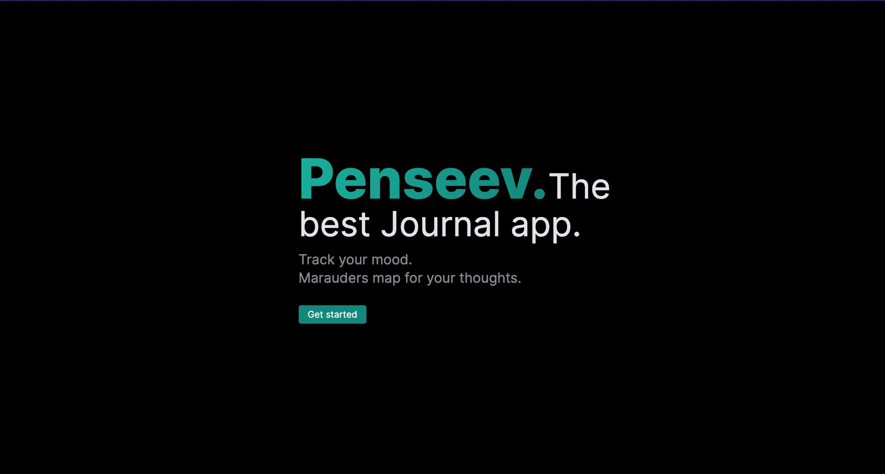
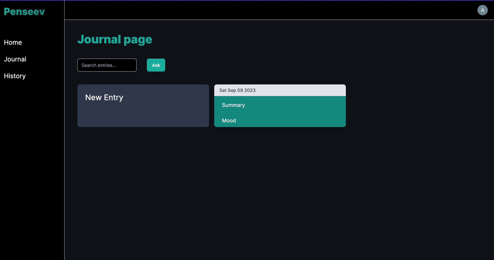

#Penseev

A simple journal AI app which kinda summarizes your feelings using AI based on your journal entry. You can then ask questions based on your journal entries.

This was kind of my first experience with next/react. Mainly wanted to see how things are done here.

If you get why it was named `penseev` , I already love you.

Mainly used these beautiful projects:

1. Nextjs (app router)
2. Prisma
3. Planetscale for MySql db.
4. OpenAI
5. Langchain
6. Clerk for authentication.
7. Zod

## Getting Started

First, run the development server:

```bash
pnpm run dev
```

Spin up your db ( I used pscale cli)

```bash
pscale connect DB_NAME DB_BRANCH --port 3309
```

Ofcourse don't forget to set up prisma.

```bash
npx prisma db push
```

Home:


All journals appear here:

